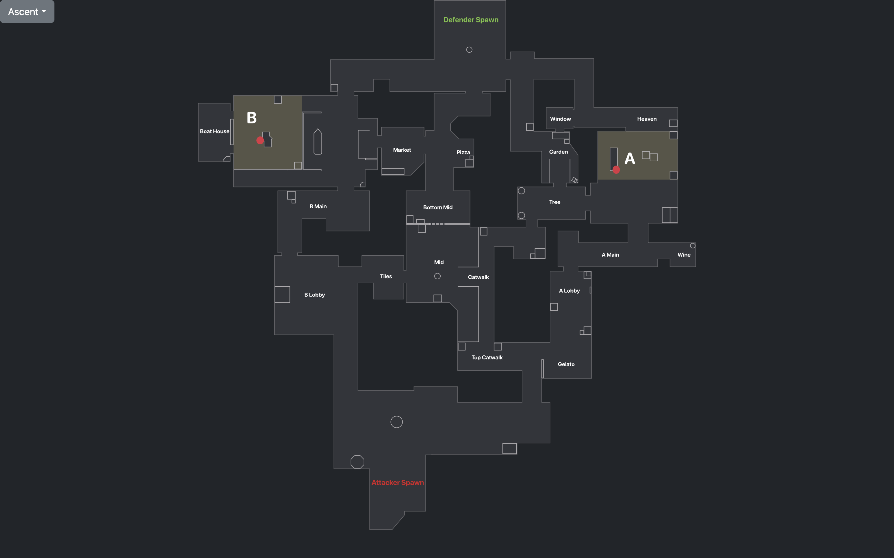
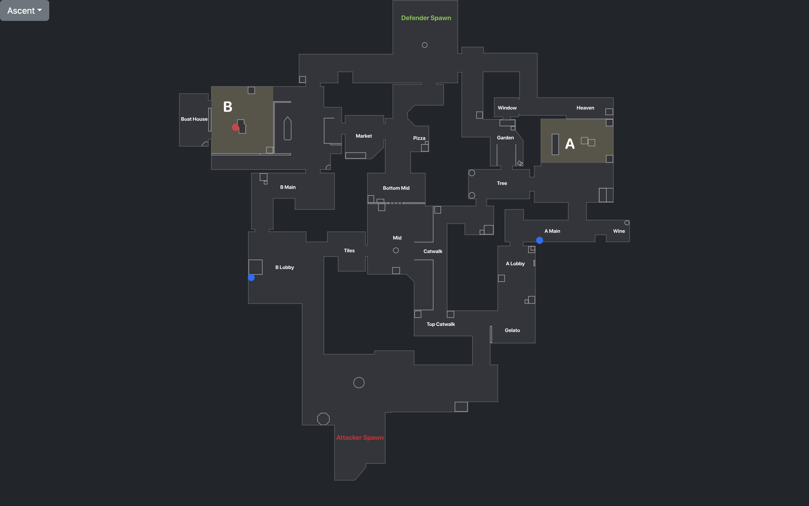
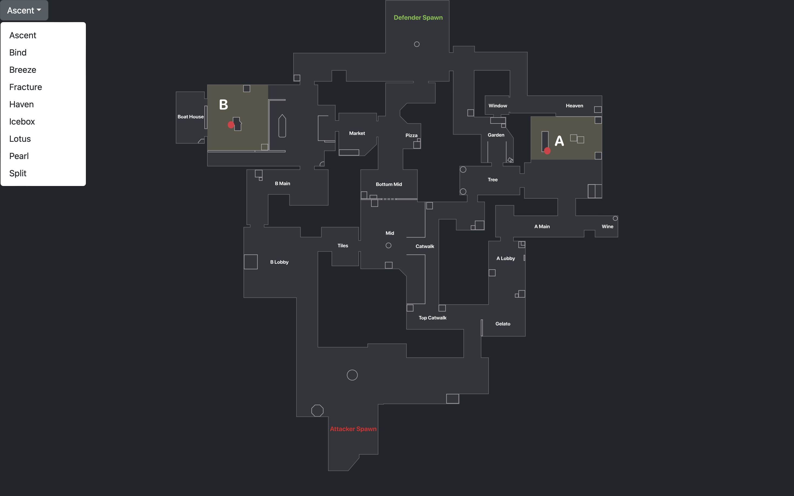

# Valorant Lineups Lookup

This program has the purpose of storing your Valorant Linups and making it easy and fast to look them up ingame.

## Disclaimer

This program is by no means finished and I have currently no interest in continuing to work on it. If you wish to use it, you'll have to understand the source code to add your own lineups and build an executable on your own machine.

## Setup

You need to have `Rust` installed for the program to work.

After you have installed vite by running `npm i vite` you can run the dev-server for the browser by running `npm run dev` or as an application by running `npm run tauri dev`

## Screenshots

